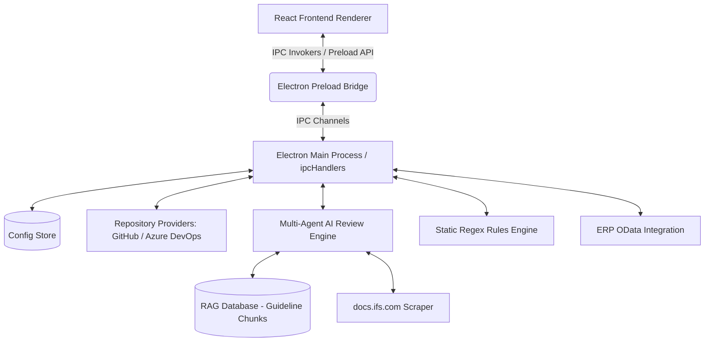
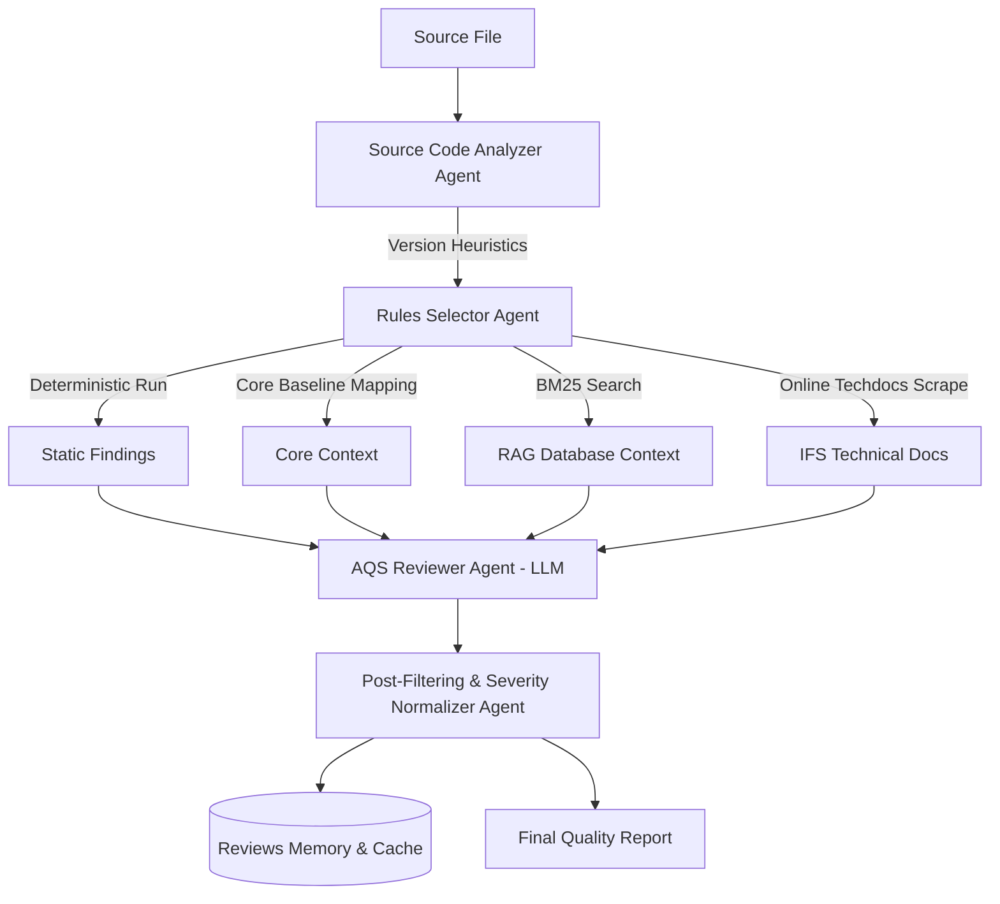

# AQS Inspect v4.0 - Detailed Technical Documentation

This document provides a comprehensive technical overview of **AQS Inspect v4.0**, an enterprise-grade static code analysis and AI-powered review application. It covers the system architecture, technology stack, detailed code explanations, security configurations, and user safety aspects.

---

## Table of Contents
1. [System Overview and Tech Stack](#system-overview-and-tech-stack)
2. [High-Level Architecture](#high-level-architecture)
3. [Frontend Architecture and Screen Workflows](#frontend-architecture-and-screen-workflows)
4. [IPC Bridge and Context Isolation](#ipc-bridge-and-context-isolation)
5. [Backend Core and Providers](#backend-core-and-providers)
6. [Multi-Agent Review and RAG Engines](#multi-agent-review-and-rag-engines)
7. [Deterministic and Dynamic Rules Engines](#deterministic-and-dynamic-rules-engines)
8. [Security and User Safety Design](#security-and-user-safety-design)

---

## System Overview and Tech Stack

AQS Inspect is built as a cross-platform desktop application leveraging the **Electron** framework combined with **React** and **Vite** for the user interface. It is specifically designed to inspect customer solution files (such as PL/SQL databases, Aurena UI definitions, and legacy C# forms) for compliance with the **Aurena Quality Standard (AQS)** and **IFS ERP** specifications.

### Core Technologies

*   **Desktop Shell:** Electron (v30.0.0)
*   **Frontend Framework:** React (v18.2.0)
*   **Build Tool & Dev Server:** Vite (v5.0.0) with `@vitejs/plugin-react`
*   **HTTP Communication:** Axios (v1.16.1)
*   **Guideline Parsers:**
    *   `pdf-parse` (v2.4.5) – Parses `.pdf` guidelines.
    *   `officeparser` (v7.2.1) – Extracts text from `.docx`, `.pptx`, `.xlsx` files.
*   **Notification Engine:** `nodemailer` (v9.0.1) – Integrates SMTP for sending reports.
*   **Styling:** Vanilla CSS with custom property tokens (supporting glassmorphism, responsive grids, dark mode settings, and interactive micro-animations).

---

## High-Level Architecture

The application employs a decoupled architecture separating UI display from OS-level operations, communicating through an IPC Bridge.

*   **Renderer Process:** Handles screens, file tree selection, interactive diff views, and feedback chips.
*   **Main Process:** Executes CPU-intensive file system traversals, makes external network connections, handles local databases (caching and memory), and communicates with LLM endpoints (Azure OpenAI, OpenAI, or local Ollama).

---

## Frontend Architecture and Screen Workflows

The frontend codebase is written in React JSX, centered in [App.jsx](file:///C:/AQSinspect/src/App.jsx) and backed by modular screen views under `src/components/` and `src/SetupScreen.jsx`.

### Key Screens & Workflows

1.  **Welcome / Setup Screen (`src/SetupScreen.jsx`):**
    *   *Purpose:* Displayed on initial load if no configuration exists.
    *   *Logic:* Allows users to toggle between GitHub and Azure DevOps repositories. It requires credentials (PAT, organization name, project, repository) and calls `window.api.saveConfig` to persist settings in the main process.
2.  **Dashboard Screen (`src/App.jsx`):**
    *   *Purpose:* Main workspace. Includes the PR navigation sidebar, code tree panel, status alerts, filter cards, and the central diff editor.
    *   *Logic:*
        *   Automatically loads pull requests upon selecting a repository or changing customers (in multi-repo mode).
        *   Loads files changed in a PR dynamically inside a custom [FileTree.jsx](file:///C:/AQSinspect/src/components/FileTree.jsx) component.
        *   Features a responsive, resizable panel divider using browser mouse event bindings.
3.  **Diff Viewer Screen (`src/components/DiffViewer.jsx`):**
    *   *Purpose:* A side-by-side or unified split code comparison tool.
    *   *Logic:*
        *   Parses raw unified git diffs into individual change hunks using Myers diff algorithms.
        *   Displays code modifications line-by-line with custom colors indicating lines added (`(+)`), removed (`(-)`), or modified.
        *   Includes inline AI action triggers allowing developers to generate smart fixes for specific warnings in real time.
4.  **AI Insights (`src/components/AIInsightsPanel.jsx`):**
    *   *Purpose:* Quality summary overview of the repository scan.
    *   *Logic:* Generates an overall compliance score (100-point scale with penalties for blockers and major defects) using an interactive SVG circular progress indicator. Offers filtering by severity level.
5.  **Settings Panel (`src/SettingsScreen.jsx`):**
    *   *Purpose:* Configuration portal.
    *   *Logic:*
        *   Manages repository preferences (credentials, multi-tenant mappings, and target branches).
        *   Configures SMTP setups (SMTP host, CC emails, passwords) and tests connections instantly.
        *   Controls AI Provider toggles (Azure OpenAI API parameters, OpenAI deployments, or Ollama endpoints) and validates API key connections.
        *   Manages the RAG Guideline folder path and initiates core solution baseline mappings.
        *   Rules catalog grid view allowing developers to import/export rule configurations, view descriptions, and toggle rule approval statuses.

---

## IPC Bridge and Context Isolation

To protect the host operating system from unsafe web contexts, Electron enforces `contextIsolation: true` and `nodeIntegration: false`. All operations requiring file system access, network connections, or child process executions are routed through a secure IPC interface defined in [preload.js](file:///C:/AQSinspect/electron/preload.js).

The preload bridge exposes the safe global object `window.api` containing the following interfaces:

| API Group | Method Name | Invokes IPC Channel | Description |
| :--- | :--- | :--- | :--- |
| **Config** | `getConfig()`, `saveConfig(data)`, `clearConfig()` | `config:get`, `config:save`, `config:clear` | Manages local JSON configuration persistence. |
| **Repos** | `listPullRequests(payload)`, `getPullRequestDetails(payload)` | `repo:listPullRequests`, `repo:getPullRequestDetails` | Queries PR catalogs and commit attributes. |
| **Review** | `runAIReview(payload)`, `reviewRepository(payload)` | `review:run`, `review:repo` | Executes diff-based or repository-wide static and AI reviews. |
| **Rules** | `listRules()`, `updateRule(payload)`, `approveRule(payload)` | `rules:list`, `rules:update`, `rules:approve` | Manages the static regex rules directory. |
| **ERP** | `verifyIFSConnection(config)`, `fetchIFSMetadata()` | `mcp:verifyIFSConnection`, `mcp:fetchIFSMetadata` | Queries ERP OData endpoints for database schemas. |

---

## Backend Core and Providers

The backend logic resides in the Electron Main process, organized by concerns.

### Configuration Store (`configStore.js`)
Config metadata is saved as a JSON file in the standard OS user-profile directory (`app.getPath('userData')/config.json`). The store applies a deep merge strategy to avoid overwriting unrelated settings when partial configurations are updated. It also enforces legacy backward compatibility by keeping single and multi-repository field parameters in sync.

### Repository Providers (`electron/providers/`)
Repository adapters share a common interface to query remote servers:
*   [githubProvider.js](file:///C:/AQSinspect/electron/providers/githubProvider.js) – Calls standard GitHub REST v3 search and issues endpoints. Resolves user profile details and commit histories to extract public email identifiers for pull request authors.
*   [azureProvider.js](file:///C:/AQSinspect/electron/providers/azureProvider.js) – Queries Azure DevOps Services API endpoints (v7.1) using basic authentication. Auto-parses Azure Git repo structures from project web links.
*   `cache.js` – Implements an in-memory repository cache with TTL limits to avoid API throttling.
*   `http.js` – Standardizes HTTPS requests with automatic retries for transient failures (e.g., status codes 429, 502, 503, 504).

---

## Multi-Agent Review and RAG Engines

AQS Inspect utilizes a **Multi-Agent** structure combined with **Retrieval-Augmented Generation (RAG)** to provide deep code reviews.

### Digital Worker Agents (`electron/reviewEngine/agents.js`)

1.  **Source Code Analyzer Agent:** Inspects file extensions and keywords to determine the codebase version. It classifies files into database objects (Apps10 PL/SQL) or Aurena layouts (IFS Cloud Marble models).
2.  **Rules Selector Agent:** Pulls approved static check templates matching the file category, executes a deterministic regex run, and passes findings forward.
3.  **Context Pruning Agent:** Prevents LLM token overflows by cropping large codebases. It preserves code blocks surrounding modified lines while removing large unchanged sections.
4.  **AQS Reviewer Agent (LLM Driver):** Assembles and formats prompts, calling the configured LLM. Supports OpenAI API contracts, Azure OpenAI endpoint models, and local Ollama targets.
5.  **Post-Filtering & Severity Normalizer:** Standardizes severity classifications. It applies context checks to filter out false positives (e.g., ignoring database-specific null checks in client-side declarative code) and adds explanatory details for Oracle PL/SQL compiler errors.

### RAG Guideline Database (`electron/reviewEngine/ragDatabase.js`)
*   *Indexing:* Scans local folders containing guidelines (`.txt`, `.md`, `.docx`, `.pptx`, `.xlsx`, `.pdf`). Files are split into chunks of 1,000 characters with a 200-character overlap.
*   *Retrieval:* Utilizes the **BM25 algorithm** (Best Matching 25) with default parameters ($k_1 = 1.2$, $b = 0.75$). Query terms are extracted from the changed code (excluding generic keywords) and matched against guideline chunks to feed relevant context to the LLM.

### Online Technical Docs Scraper (`electron/reviewEngine/ifsDocsScraper.js`)
If enabled, the scraper fetches the search index (`search_index.json`) for the target IFS version from `docs.ifs.com`. It queries the LLM to extract search terms, scores documents based on title and keyword frequency, and writes relevant guides to the RAG database directory.

### Review Cache (`electron/reviewEngine/reviewCache.js`)
Ensures identical file modifications are not re-submitted to the LLM. It generates a SHA-256 hash derived from:
1.  The raw source code content.
2.  The LLM configurations (model deployment, temperature, api version).
3.  Active approved static rules.
4.  RAG parameters (modified times of files inside the guidelines folder).
Any configuration change automatically invalidates the cache.

---

## Deterministic and Dynamic Rules Engines

AQS Inspect pairs deterministic checks with dynamically discovered rules.

### Static Rules Engine (`electron/reviewEngine/ruleEngine.js`)
Applies regex rules to file contents. If `alertOnMissing` is enabled, it flags the *absence* of a pattern (e.g., missing license headers).

### Dynamic Rule Miner (`electron/reviewEngine/dynamicRuleBuilder.js`)
Scans configured core solution directories to identify coding patterns:
*   *Phase 1:* Classified scanned files by version and component.
*   *Phase 2:* Counts occurrences of patterns (e.g., cursors prefixed with `c_`, variables, dynamic SQL execution).
*   *Phase 3:* Computes compliance rates. Patterns with high compliance rates are stabilized as new rules (initially marked as unapproved).
*   *Phase 4:* Generates rule catalogs (`ifs_validation_rule_catalog.json`) and Markdown documentation (`ifs_validation_rules_documentation.md`).

---

## Security and User Safety Design

AQS Inspect is designed with user privacy and workspace isolation in mind.

1.  **PII & Credentials Scrubbing:**
    *   The `redactSecrets` function scans text before it is sent to external LLMs. It replaces API keys, passwords, bearer tokens, and client secrets with placeholders like `[REDACTED_PASSWORD]` and `[REDACTED_TOKEN]`.
2.  **Context Isolation:**
    *   The renderer runs in an isolated context. Scripts on screens cannot access the file system or run system commands directly. They must use the explicit IPC bridge.
3.  **Local-First Storage:**
    *   All configuration profiles, review caches, RAG indices, and database files are stored locally in the user's workspace directory. No telemetry or repository code is transmitted to third-party tracking services.
4.  **Read-Only ERP Integrations:**
    *   The OData connection adapter communicates with target ERP systems using read-only requests. It fetches metadata schemas without performing state-changing transactions.
5.  **Multi-Repository Workspace Scoping:**
    *   Vite configurations restrict resources to the active workspace, protecting unrelated system directories from access.
